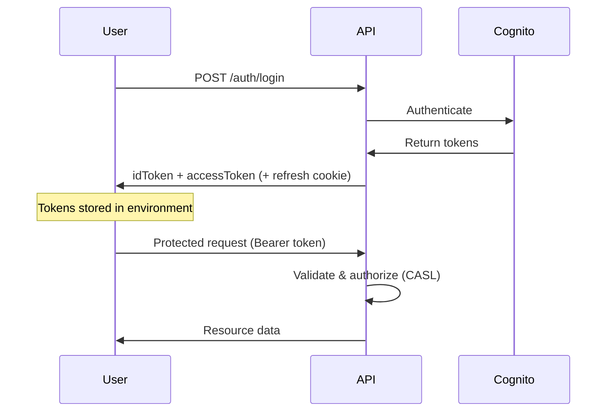

# My Many Books API - Postman Testing Collection

**Last Updated:** December 2025

This directory contains a comprehensive Postman collection for testing the My Many Books API, including authentication (AWS Cognito), authorization (CASL), audit logging, hooks system, and all CRUD operations.

## 📁 Contents

### Collections
- **`My-Many-Books-API.postman_collection.json`** - Complete API testing collection with 80+ endpoints

### Environments
- **`environments/Local-Development.postman_environment.json`** - Local development environment
- **`environments/AWS-Development.postman_environment.json`** - AWS development environment
- **`environments/AWS-Production.postman_environment.json`** - AWS production environment

### Utility Scripts
- **`scripts/authentication-helper.js`** - Authentication utilities for Cognito
- **`scripts/test-data-generator.js`** - Generate random test data
- **`scripts/validation-helpers.js`** - Response validation utilities

## 🚀 Quick Start

1. **Import Collection**
   - Open Postman
   - Click "Import" > Select `My-Many-Books-API.postman_collection.json`

2. **Import Environment**
   - Import `environments/Local-Development.postman_environment.json`
   - Or choose AWS-Development/AWS-Production for deployed environments

3. **Authentication Flow**
   ```
   1. Register (or use existing account)
   2. Login → Automatically stores idToken and accessToken
   3. All subsequent requests use stored Bearer token
   4. Token refresh happens automatically
   ```

4. **Start Testing**
   - Run requests individually or use Collection Runner
   - All requests include x-trace-id header for log correlation

## 📋 API Endpoints Coverage

### Authentication (AWS Cognito)
- `POST /auth/register` - Register new user
- `POST /auth/login` - Login (stores tokens automatically)
- `POST /auth/refresh` - Refresh expired tokens
- `POST /auth/logout` - Logout and clear tokens

**Features:**
- Automatic token storage in environment variables
- Token expiry tracking
- Bearer token authentication on all protected endpoints

### Health Check
- `GET /health` - API health status

### Books Management (CASL Authorization)
- `GET /books` - List all books (public read)
- `GET /books/:id` - Get book by ID
- `POST /books` - Create new book (requires auth)
- `PUT /books/:id` - Update book (requires ownership or admin)
- `DELETE /books/:id` - Delete book (requires ownership or admin)
- `GET /books/search` - Search books by title/author/category/status
- `GET /books/search/isbn` - Search book by ISBN in library
- `POST /books/import/isbn` - Import book from Open Library

### Authors Management
- `GET /authors` - List all authors (user-scoped)
- `GET /authors/:id` - Get author by ID
- `POST /authors` - Create new author
- `PUT /authors/:id` - Update author (requires ownership or admin)
- `DELETE /authors/:id` - Delete author (requires ownership or admin)
- `GET /authors/:id/books` - Get all books by author
- `GET /authors/search` - Search authors by name

### Categories Management
- `GET /categories` - List all categories (user-scoped)
- `GET /categories/:id` - Get category by ID
- `POST /categories` - Create new category
- `PUT /categories/:id` - Update category (requires ownership or admin)
- `DELETE /categories/:id` - Delete category (requires ownership or admin)
- `GET /categories/:id/books` - Get all books in category
- `GET /categories/search` - Search categories by name

### ISBN Services
- `GET /isbn/:isbn` - Lookup book by ISBN from Open Library
- `GET /isbn/validate/:isbn` - Validate ISBN format and checksum
- `GET /isbn/search` - Search Open Library by title/author
- `POST /isbn/batch` - Batch lookup multiple ISBNs
- `GET /isbn/stats` - Get ISBN service statistics (requires auth)
- `DELETE /isbn/cache` - Clear ISBN cache (requires auth)

### Admin - User Management (Admin Only)
- `GET /admin/users` - List all users
- `PUT /admin/users/:id/role` - Update user role (user/admin)
- `PUT /admin/users/:id/active` - Toggle user active status

### Admin - Hooks Management (Admin Only)
- `GET /admin/hooks` - List all hooks
- `GET /admin/hooks/stats` - Get hook execution statistics
- `POST /admin/hooks` - Create new hook
- `GET /admin/hooks/:id/executions` - Get hook execution history
- `POST /admin/hooks/reload` - Reload hooks from database

### Admin - Audit Logs (Admin Only)
- `GET /admin/audit-logs` - Query audit logs with filters
  - Filter by: userId, action, resourceType, startDate, endDate
  - Pagination: limit, offset
- `GET /admin/audit-logs/trace/:traceId` - Get audit logs by trace ID

### Admin - Settings (Admin Only)
- `GET /admin/settings` - Get all system settings
- `PUT /admin/settings/:key` - Update setting (e.g., audit_logging_enabled)

### Admin - Statistics (Admin Only)
- `GET /admin/stats` - Get system statistics

## 🔧 Environment Variables

### Base Configuration
- `baseUrl` - API base URL (e.g., `http://localhost:3000/api/v1`)
- `apiVersion` - API version (v1)
- `environment` - Environment name (development/production)
- `timeout` - Request timeout in milliseconds

### Authentication (Auto-managed)
- `idToken` - JWT ID token (stored after login)
- `accessToken` - JWT access token (stored after login)
- `tokenExpiry` - Token expiration timestamp
- `userId` - Current user ID
- `userRole` - Current user role (user/admin)

### Test Credentials
- `testEmail` - Test user email (test@example.com)
- `testPassword` - Test user password
- `testIsbn` - Sample ISBN for testing (978-0-596-52068-7)

### Request Correlation
- `traceId` - Auto-generated UUID for request correlation (x-trace-id header)

### Dynamic Test Data (Auto-populated)
- `createdBookId` - ID of recently created book
- `createdAuthorId` - ID of recently created author
- `createdCategoryId` - ID of recently created category
- `importedBookId` - ID of imported book
- `bookId` - Sample book ID for GET/UPDATE/DELETE operations
- `hookId` - Sample hook ID for admin operations

### Search Parameters
- `searchTitle` - Default title for search tests (1984)
- `searchAuthor` - Default author for search tests (Orwell)
- `searchCategory` - Default category for search tests (Fiction)
- `searchNationality` - Default nationality filter (British)

## 🔍 Testing Features

### Global Pre-request Scripts
- **TraceId Generation:** Automatic UUID generation for request correlation
- **Token Expiry Check:** Warns when tokens are expired
- **Timestamp Management:** Auto-generated timestamps for test data

### Global Test Scripts
- **Response Time Validation:** All requests validate < 5s response time
- **Status Code Validation:** Ensures valid HTTP status codes
- **Automatic Variable Storage:** Stores created resource IDs for subsequent tests

### Request-level Tests
- **Authentication:** Token storage, expiry tracking, role validation
- **CRUD Operations:** ID storage, success verification
- **Error Handling:** Proper error response validation

### Collection-level Features
- **Bearer Token Authentication:** Auto-injected on all protected endpoints
- **TraceId Header:** Included in all requests for log correlation
- **Environment-specific Configurations:** Switch between local/dev/prod seamlessly

## 🛡️ Authentication & Authorization

### Authentication Flow



### Authorization (CASL)

**Roles:**
- **user:** Can read and manage only own resources
- **admin:** Full access to all resources + admin endpoints

**Permission Examples:**
- Books, Authors, Categories: User-scoped, authenticated create, ownership/admin for update/delete
- Admin endpoints: Admin role required

### Testing Without Authentication
```javascript
// In environment variables
"authEnabled": "false"  // For public endpoints only
```

## 📊 Request Correlation (TraceId)

Every request includes a `x-trace-id` header for log correlation:

```javascript
// Auto-generated in pre-request script
x-trace-id: "550e8400-e29b-41d4-a716-446655440000"
```

**Benefits:**
- Correlate all logs for a single request
- Debug issues by searching for traceId
- View audit logs for specific requests: `GET /admin/audit-logs/trace/:traceId`

## 🔄 Running Collection Tests

### Individual Request Testing
1. Select environment (Local-Development)
2. Login first (stores tokens)
3. Run individual requests
4. Check test results and response

### Collection Runner
1. Click "Runner" in Postman
2. Select "My Many Books API" collection
3. Select environment
4. Configure:
   - Iterations: 1
   - Delay: 500ms (between requests)
5. Run collection
6. Review test results

### Automated Testing (Newman)
```bash
# Install Newman
npm install -g newman

# Run collection
newman run My-Many-Books-API.postman_collection.json \
  -e environments/Local-Development.postman_environment.json \
  --reporters cli,html \
  --reporter-html-export results.html

# Run with delay
newman run My-Many-Books-API.postman_collection.json \
  -e environments/Local-Development.postman_environment.json \
  -d 500
```

## 🐛 Error Scenarios

The collection includes comprehensive error testing:

- **400 Bad Request** - Invalid request data, validation errors
- **401 Unauthorized** - Missing/invalid authentication token
- **403 Forbidden** - Insufficient permissions (CASL authorization)
- **404 Not Found** - Non-existent resources
- **422 Unprocessable Entity** - Business logic validation errors
- **500 Internal Server Error** - Server errors

## 📈 Monitoring and Analytics

### Response Time Testing
- All requests validate response time < 5000ms
- Configurable per environment

### Success Rate Tracking
- Automatic success/failure tracking via test scripts
- Error response structure validation

### Performance Monitoring
- Response time logging
- Request/response size tracking
- Cache hit/miss analysis (ISBN services)

## 🔧 Customization

### Adding New Endpoints
1. Create new request in appropriate folder
2. Add x-trace-id header
3. Include test scripts for validation
4. Update this README

### Custom Validation
```javascript
// In test script
pm.test("Custom validation", function() {
    const jsonData = pm.response.json();
    pm.expect(jsonData).to.have.property('data');
    pm.expect(jsonData.data).to.be.an('array');
});
```

### Environment Setup
1. Copy existing environment file
2. Modify base URL
3. Update authentication credentials
4. Adjust timeout settings

## 📚 Best Practices

### Authentication
1. **Always login first** when testing protected endpoints
2. **Check token expiry** - tokens expire after 1 hour
3. **Use refresh endpoint** when tokens expire
4. **Test both user and admin roles** for authorization

### Test Organization
1. **Run authentication requests first**
2. **Create resources before testing updates/deletes**
3. **Use stored variables** (createdBookId, etc.) for dynamic tests
4. **Clean up test data** after test runs

### Data Management
1. **Use unique test data** (timestamps, random suffixes)
2. **Store created IDs** in environment variables
3. **Implement proper test isolation**
4. **Clean up after destructive tests**

### Error Testing
1. **Test all error scenarios**
2. **Validate error response structure**
3. **Include edge cases and boundary conditions**
4. **Test authorization boundaries** (user vs admin)

## 🆕 What's New (December 2025)

### Authentication
- ✅ Complete AWS Cognito authentication flow
- ✅ Automatic token management (idToken, accessToken)
- ✅ Token refresh support
- ✅ Token expiry tracking

### Authorization
- ✅ CASL-based role-based access control (RBAC)
- ✅ Ownership verification for resources
- ✅ Admin-only endpoints protection

### Audit Logging
- ✅ Query audit logs with filters
- ✅ TraceId correlation for request tracking
- ✅ Admin toggle support

### Hooks System
- ✅ Hooks management (CRUD)
- ✅ Hook execution history
- ✅ Hook statistics
- ✅ Runtime reload without restart

### Complete CRUD Operations
- ✅ Authors: Full CRUD + search + get author's books
- ✅ Categories: Full CRUD + search + get category's books
- ✅ Books: Full CRUD + search + import from ISBN

### ISBN Services
- ✅ ISBN validation
- ✅ Batch lookup
- ✅ Statistics and cache management
- ✅ Open Library search

### Request Correlation
- ✅ TraceId header on all requests
- ✅ Automatic UUID generation
- ✅ Audit log correlation by traceId

## 🤝 Contributing

When adding new tests or modifying existing ones:

1. Follow existing naming conventions
2. Include comprehensive test assertions
3. Add appropriate documentation
4. Test in multiple environments
5. Validate authentication and authorization scenarios
6. Include x-trace-id header for log correlation

## 🔗 Related Documentation

- [API Documentation](../../docs/api/)
- [Authentication Guide](../../docs/auth/)
- [Authorization Guide](../../docs/authorization/)
- [Logging Architecture](../../docs/logging/)
- [Hooks System](../../docs/hooks/)
- [Deployment Guide](../../DEPLOYMENT.md)

## 📞 Support

- **Issues:** [GitHub Issues](https://github.com/my-many-books/issues)
- **Documentation:** [Project Wiki](https://github.com/my-many-books/wiki)
- **Slack:** #api-testing channel
